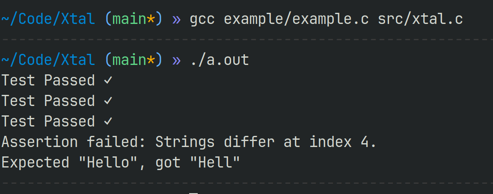
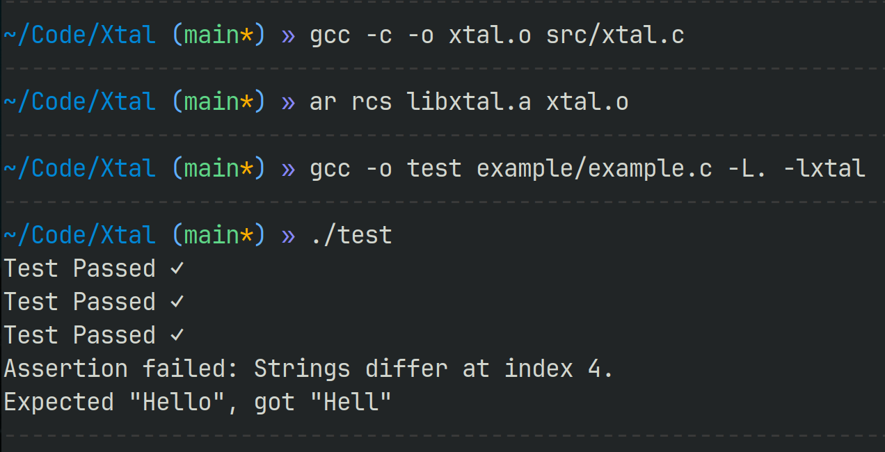

# Xtal

A single file C unit test  macro-based tool (a lot of words...).
Create your own library or just compile your test file with xtal.c

### Syntax:
```c
#include "xtal.h"

TEST(test_name) {
    //Your code
    ASSERT_SOMETHING(args...);
}

int main() {
    run_tests();
}
```

### Basic Usage:


### Make a library
